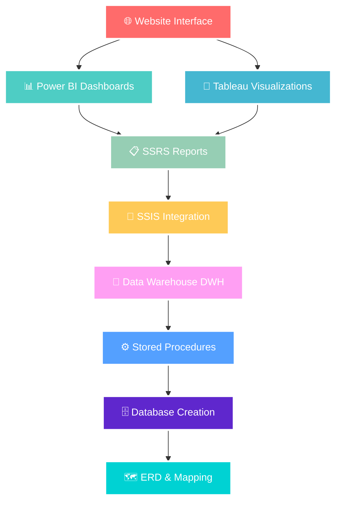

<div align="center">


<h1>🚀 ITI Examination & Business Intelligence System</h1>

<p>
  
</p>

<p>
  
  
  
  
  
  
</p>

<p>
  
  
  
</p>


</div>

## 🎯 Project Overview

<div align="center">

</div>

> **Building the Future of Educational Management** 🌟

This project represents a **revolutionary end-to-end solution** designed to transform how the Information Technology Institute (ITI) manages its academic operations. We're not just building a database - we're crafting a complete ecosystem that handles everything from student registration to advanced business intelligence.

---

## 🏗️ System Architecture & ERD

<div align="center">


### Our Multi-Layered Architecture



### 🎯 Our Complete Technology Stack

| Layer | Technology | Status | Description |
|-------|------------|--------|-------------|
| 🗺️ **ERD Design** | Draw.io | ✅ Complete | Entity Relationship Diagram & Database Design |
| 🗺️ **Mapping** | SQL Server | ✅ Complete | Table Relations & Foreign Key Constraints |
| 🏗️ **Database Creation** | T-SQL Scripts | ✅ Complete | Full Database Implementation with 25+ Tables |
| ⚙️ **Stored Procedures** | T-SQL | ✅ Complete | 70+ Procedures for CRUD & Business Logic |
| 🏢 **Data Warehouse** | SQL Server | 🔄 In Progress | Star Schema Design & Implementation |
| 🔄 **SSIS Integration** | SQL Server Integration Services | 🔄 In Progress | ETL Pipelines & Data Migration |
| 📋 **SSRS Reports** | SQL Server Reporting Services | 🔄 In Progress | 15+ Professional Reports |
| 📊 **20+ Dashboards** | Power BI & Tableau | 🔄 In Progress | Interactive Business Intelligence |
| 📈 **Power BI** | Microsoft Power BI | 🔄 In Progress | Executive & Operational Dashboards |
| 🎨 **Tableau Desktop** | Tableau | 🔄 In Progress | Advanced Data Visualizations |
| 🌐 **Website Interface** | ASP.NET Core / React | 📋 Planned | Modern Web Application |
</div>

---

## 📊 Database Schema Deep Dive

### 🗂️ Core Tables Breakdown

<details>
<summary>🎓 <strong>Student Management Tables</strong></summary>

| Table | Key Fields | Description |
|-------|------------|-------------|
| **👨‍🎓 Student** | `St_ID`, `St_Fname`, `St_Lname`, `Email` | Complete student profiles with validation |
| **📚 Course** | `Crs_ID`, `Crs_Name`, `Duration` | Course catalog and details |
| **🏃‍♂️ Track** | `Track_ID`, `Track_Name`, `SuperV_Inst` | Academic tracks with supervision |
| **🏢 Branch** | `Branch_ID`, `Branch_Name`, `Location` | Institute branch management |

</details>

<details>
<summary>👨‍🏫 <strong>Instructor & Teaching Tables</strong></summary>

| Table | Key Fields | Description |
|-------|------------|-------------|
| **👨‍🏫 Instructor** | `Inst_ID`, `Inst_Name`, `Salary`, `Degree` | Faculty management system |
| **🔗 Inst_Crs** | `Inst_ID`, `Crs_ID` | Instructor-Course assignments |
| **📅 Inst_Events** | `Inst_ID`, `Event_ID` | Event participation tracking |

</details>

<details>
<summary>📝 <strong>Examination System Tables</strong></summary>

| Table | Key Fields | Description |
|-------|------------|-------------|
| **📋 Exam** | `Exam_ID`, `Exam_Type`, `Start_Time` | Comprehensive exam management |
| **❓ Questions** | `Ques_ID`, `Question`, `Crs_ID` | Question bank with categorization |
| **✅ St_Answer** | `St_ID`, `Ques_ID`, `St_Answer` | Student response tracking |
| **🎯 St_Grade** | `St_ID`, `Exam_ID`, `Grade` | Grade management system |

</details>

---

## ⚙️ Powerful Database Procedures

### 🛠️ Core System Functions

<details>
<summary>🎲 <strong>Exam Generation System</strong></summary>

```sql
-- 🎯 Smart Exam Generation
EXEC dbo.genrate_exam @CourseID = 101, @ExamType = 'Final'

-- 📝 Student Exam Assignment  
EXEC dbo.assign_Exam @StudentID = 1001, @ExamID = 5001

-- 📊 Grade Calculation
EXEC dbo.getresult @StudentID = 1001, @ExamID = 5001
```

</details>

<details>
<summary>📈 <strong>Advanced Reporting Suite</strong></summary>

- 📚 **Course Topics Report**: `GetTopicsByCourse` ✅
- 👥 **Students by Track**: Advanced filtering and sorting 🔄
- 🎓 **Student Grade Analytics**: Complete academic history 🔄  
- 👨‍🏫 **Instructor Workload**: Teaching load analysis 🔄
- 📋 **Student Answer Sheet**: Detailed exam responses 🔄

</details>

---

## 🗺️ Project Roadmap

### Phase Progress Tracker

```
Phase 1: Database Design        ████████████████████ 100% ✅
Phase 2: Implementation         ████████████████████ 100% ✅  
Phase 3: Data Population        ████████████████████ 100% ✅
Phase 4: Core Procedures        ████████████████████ 100% ✅
Phase 5: BI & Reporting         ████████████░░░░░░░░  75% 🔄
Phase 6: Application Dev        ████░░░░░░░░░░░░░░░░  25% 🔄
```

### 🚀 Upcoming Features

- 🏢 **Data Warehouse Design** - Star schema implementation
- 🔄 **SSIS ETL Packages** - Automated data pipelines  
- 📊 **Power BI Dashboards** - 20+ interactive reports
- 🎨 **Tableau Visualizations** - Executive dashboards
- 💻 **Desktop Application** - C# WinForms interface
- 🌐 **Web Application** - Modern web interface

---
## 🌟 Meet Our Legendary Team

<div align="center">
<h2>🔥 The Code Warriors 🔥</h2>

<table>
<tr>

<!-- Moataz Elmesmary -->
<td align="center">
<div style="position: relative;">

<br />

<br />
<sub><b>🔥 Moataz Elmesmary</b></sub>
<br />
<sub>BI Dev & Data Analyst</sub>
</div>
<br />
<a href="https://github.com/moataz-elmesmary">

</a>
<br />
<a href="https://linkedin.com/in/moataz-elmesmary">

</a>
</td>

<!-- Omar Elqersh -->
<td align="center">
<div style="position: relative;">

<br />

<br />
<sub><b>⚡ Omar Elqersh</b></sub>
<br />
<sub>BI Dev & Data Analyst</sub>
</div>
<br />
<a href="https://github.com/omar-elqersh">

</a>
<br />
<a href="https://linkedin.com/in/omar-elqersh">

</a>
</td>

<!-- Ahmed Mekky -->
<td align="center">
<div style="position: relative;">

<br />

<br />
<sub><b>💎 Ahmed Mekky</b></sub>
<br />
<sub>BI Dev & Data Analyst</sub>
</div>
<br />
<a href="https://github.com/ahmed-mekky">

</a>
<br />
<a href="https://linkedin.com/in/ahmed-mekky">

</a>
</td>

<!-- Abdelrahman Hisham -->
<td align="center">
<div style="position: relative;">

<br />

<br />
<sub><b>🎯 Abdelrahman Hisham</b></sub>
<br />
<sub>BI Dev & Data Analyst</sub>
</div>
<br />
<a href="https://github.com/abdelrahman-hisham">

</a>
<br />
<a href="https://linkedin.com/in/abdelrahman-hisham">

</a>
</td>

<!-- Seif Salah -->
<td align="center">
<div style="position: relative;">

<br />

<br />
<sub><b>🌟 Seif Salah</b></sub>
<br />
<sub>BI Dev & Data Analyst</sub>
</div>
<br />
<a href="https://github.com/seif-salah">

</a>
<br />
<a href="https://linkedin.com/in/seif-salah">

</a>
</td>

</tr>
</table>

<br />


<br />


### 🎉 Thank You for Visiting!


**Made with ❤️ by the ITI Dream Team**


</div>
