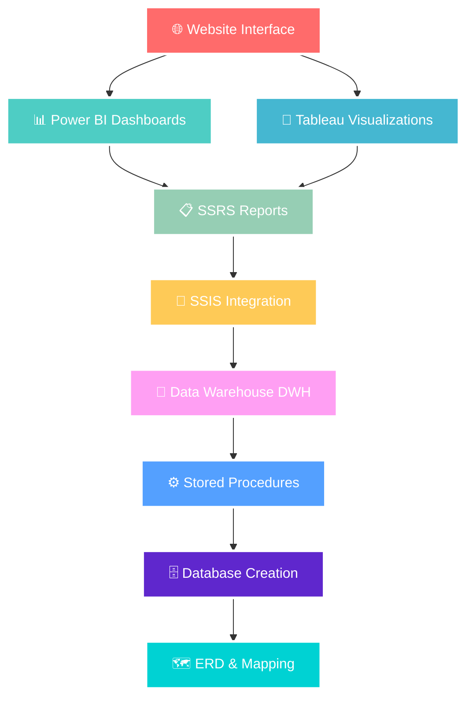

<div align="center">


<h1>🚀 ITI Examination & Business Intelligence System</h1>

<p>
  
</p>

<p>
  
  
  
  
  
</p>

<p>
  
  
  
</p>


</div>

## 🎯 Project Overview

<div align="center">

</div>

> **Building the Future of Educational Management** 🌟

This project represents a **revolutionary end-to-end solution** designed to transform how the Information Technology Institute (ITI) manages its academic operations. We're not just building a database - we're crafting a complete ecosystem that handles everything from student registration to advanced business intelligence.

---
<div align="center">
  
*Would u like to see a sample of our 20+ Dashboards?*
  


</div>


## 🏗️ System Architecture & ERD

<div align="center">


### Our Multi-Layered Architecture


</div>

## ERD


## Mapping


<h2> SSIS </h2> <u>sample for the Fact Table:</u>


## DWH


<div align="center">
  
### 🎯 Our Complete Technology Stack

| Layer | Technology | Status | Description |
|-------|------------|--------|-------------|
| 🗺️ **ERD Design** | Draw.io | ✅ Complete | Entity Relationship Diagram & Database Design |
| 🗺️ **Mapping** | SQL Server | ✅ Complete | Table Relations & Foreign Key Constraints |
| 🏗️ **Database Creation** | T-SQL Scripts | ✅ Complete | Full Database Implementation with 25+ Tables |
| ⚙️ **Stored Procedures** | T-SQL | ✅ Complete | 70+ Procedures for CRUD & Business Logic |
| 🏢 **Data Warehouse** | SQL Server | ✅ Complete | Star Schema Design & Implementation |
| 🔄 **SSIS Integration** | SQL Server Integration Services | ✅ Complete | ETL Pipelines & Data Migration |
| 📋 **SSRS Reports** | SQL Server Reporting Services | ✅ Complete | 6+ Professional Reports |
| 📊 **20+ Dashboards** | Power BI & Tableau | ✅ Complete | Interactive Business Intelligence |
| 📈 **Power BI** | Microsoft Power BI | ✅ Complete | Executive & Operational Dashboards |
| 🌐 **Website Interface** | ASP.NET Core / React | 📋 Planned | Modern Web Application |
</div>

---

## 🗺️ Project Roadmap

### Phase Progress Tracker

```
Phase 1: Database Design        ████████████████████ 100% ✅
Phase 2: Implementation         ████████████████████ 100% ✅  
Phase 3: Data Population        ████████████████████ 100% ✅
Phase 4: Core Procedures        ████████████████████ 100% ✅
Phase 5: BI & Reporting         ████████████████████ 100% ✅
Phase 6: Application Dev        ████░░░░░░░░░░░░░░░░  25% 🔄
```

## 🌟 Meet Our Legendary Team

<div align="center">
<h2>🔥 The Code Warriors 🔥</h2>

<table>
<tr>

<!-- Moataz Elmesmary -->
<td align="center">
<div style="position: relative;">

<br />

<br />
<sub><b>🔥 Moataz Elmesmary</b></sub>
<br />
<sub>BI Dev & Data Analyst</sub>
</div>
<br />
<a href="https://github.com/moataz-elmesmary">

</a>
<br />
<a href="https://www.linkedin.com/in/moatazelmesmary/">

</a>
</td>

<!-- Omar Elqersh -->
<td align="center">
<div style="position: relative;">

<br />

<br />
<sub><b>⚡ Omar Elqersh</b></sub>
<br />
<sub>BI Dev & Data Analyst</sub>
</div>
<br />
<a href="https://github.com/OMARELQERSH">

</a>
<br />
<a href="https://www.linkedin.com/in/omar-elqersh/">

</a>
</td>

<!-- Ahmed Mekky -->
<td align="center">
<div style="position: relative;">

<br />

<br />
<sub><b>💎 Ahmed Mekky</b></sub>
<br />
<sub>BI Dev & Data Analyst</sub>
</div>
<br />
<a href="https://github.com/ahmed-mekky">

</a>
<br />
<a href="https://www.linkedin.com/in/ahmed-m-mekky/">

</a>
</td>

<!-- Abdelrahman Hisham -->
<td align="center">
<div style="position: relative;">

<br />

<br />
<sub><b>🎯 Abdelrahman Hisham</b></sub>
<br />
<sub>BI Dev & Data Analyst</sub>
</div>
<br />
<a href="https://github.com/abdelrahman-hisham">

</a>
<br />
<a href="https://www.linkedin.com/in/abdelrahmanelshimy/">

</a>
</td>

<!-- Seif Salah -->
<td align="center">
<div style="position: relative;">

<br />

<br />
<sub><b>🌟 Seif Salah</b></sub>
<br />
<sub>BI Dev & Data Analyst</sub>
</div>
<br />
<a href="https://github.com/seif-salah">

</a>
<br />
<a href="https://www.linkedin.com/in/seifsalah036/">

</a>
</td>

</tr>
</table>

<br />


<br />


### 🎉 Thank You for Visiting!


**Made with ❤️**


</div>
